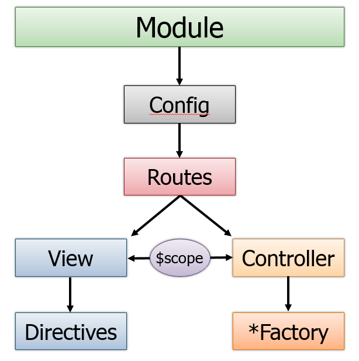

# AngularJS
* Open source JavaScript framework by Google
* Version 1.5

# Key ideas
* MVC framework for the client side
  * MVC, MVVM, MVW
* Two way data binding (**scope** is the one source of truth)
* Dependency Injection
* Reusable ui components (directives)
* Reusable logic (service)
* Gives you places to put your JavaScript!

# Key components
* **module** - namespace that groups everything below
* **view / template** - what the user sees
* **controller** - functionality for views
* **scope** - holds data for views and controllers
* **service** - reusable business logic
* **directives** - extend HTML into reusable view components
* **filters** - change the way data is presented to the user

