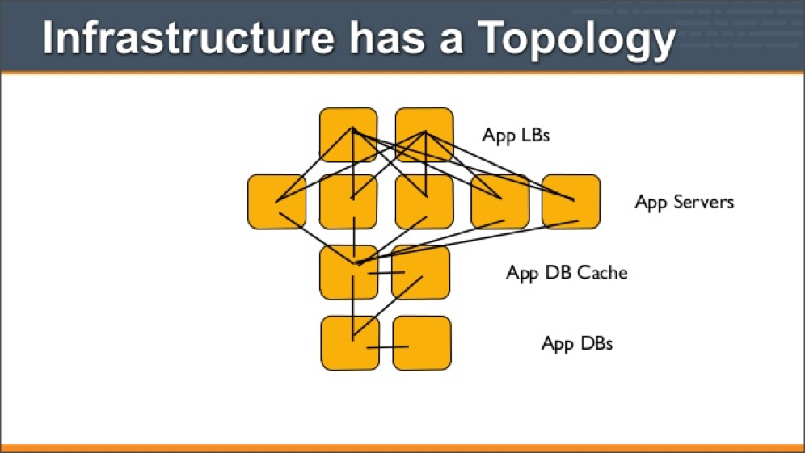
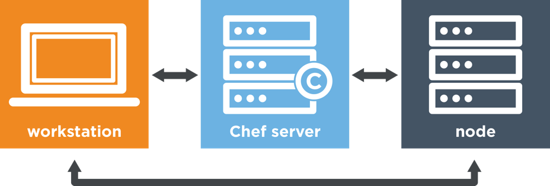

# chef

### Topics
* Configuration Management
* Chef
* Why Use Chef?
* How Chef Works
* Resources and Recipes
* Cookbooks and Run-List
* Attributes
* Roles, and Environments
* Knife
* Supermarket
* Knife-EC2 Plugin
* Test Kitchen, Vagrant, Berkshelf

### Configuration Management
* Detailed description of hardware and software configuration
* Log applied versions and updates
* List installed software packages
* Map the locations and network addresses of hardware devices
* Computer technicians can make more informed decisions
* Changes made to one system do not adversely affect other systems

### About
* Configuration Management automation tool developed by Opscode
* Based on Ruby scripting language
* Automating provisioning and configuration
* Continuously deliver applications through pipeline
* Automate testing for security and compliance
* Manage changes in multiple environments

### Benefits
* Infrastructure as code
* Repeatable
* Versionable
* Automated
* Documented
* Consistent

### How Chef works

 

### Resources and Recipes
* A Chef resource describes some piece of infrastructure
  * File
  * Template
  * Package
  * Service
* A Chef recipe is a file that groups related resources
  * Configure a web server
  * Set up database server
  * Create a load balancer
* Recipes are written in Ruby
* Apply recipes with chef-client command

### Cookbooks and Run-List
* A cookbook provides structure to your recipes
* Collection of all related files
  * Recipes
  * Scripts
  * Attribute files
  * Templates
* More manageable than having just recipes alone
* The run-list lets you specify:
  * which recipes to run
  * the order to run them
* Apply multiple cookbooks where order matters

### Attributes
* An attribute is a specific detail about a node
* Used by the chef-client to understand:
  * Current state of the node
  * State of the node at the end of the previous chef-client run
  * State of the node should be at the end of the current chef-client run
* Attributes are defined by:
  * The node itself
  * Cookbooks (in attribute files and/or recipes)
  * Roles
  * Environments

### Roles and Environments
* A role defines patterns common to many nodes
* Each role has 0 or more attributes and a run-list
* Each node can have zero (or more) roles assigned to it
* An environment maps a real-life workflow
* Chef begins with a single environment: `_default`
  * cannot be modified (or deleted)
* Additional environments can be created
  * Production, staging, testing, and development
* Environment is associated with 1+ cookbook versions

### Knife
* Chef server acts as a central repository for your cookbooks
* Chef server is a repository for information about every node it manages
* Knife command communicates from workstation to Chef server
* Knife helps users to manage:
  * Nodes
  * Cookbooks and recipes
  * Roles, and more
* Knife can upload/download cookbooks
* Knife can bootstrap a node with recipes

### Supermarket
* Chef Supermarket is the community site for cookbooks
* Cookbooks on Chef Supermarket may be used by any Chef user!
* How community cookbooks are used varies from organization to organization
* The public Chef Supermarket is hosted by Chef
  * Available at https://supermarket.chef.io
* A private Chef Supermarket may be installed on-premises behind a firewall

### Knife EC2 Plugin
* Manage cloud servers that are hosted by Amazon EC2
* Spin up new EC2 instances with knife
* Specify AMI, region, AZ, etc.
* Apply an initial run-list
* Associate Elastic IP address
* Assign security groups
* Many more options

### Test Kitchen, Vagrant, Berkshelf
* Use Kitchen to automatically test cookbook data across any combination of platforms and test suites:
  * Defined in a .kitchen.yml file
  * Supports cookbook testing across many cloud providers and VM tech
* The key concepts in Kitchen are:
  * A platform is the target of the cookbook test
  * A suite is the chef-client configuration
  * An instance is the combination of platform and suite
* Vagrant is used to create sandbox environments for Kitchen
* Berkshelf is a dependency manager for community cookbooks
