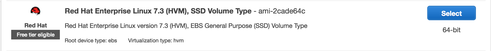
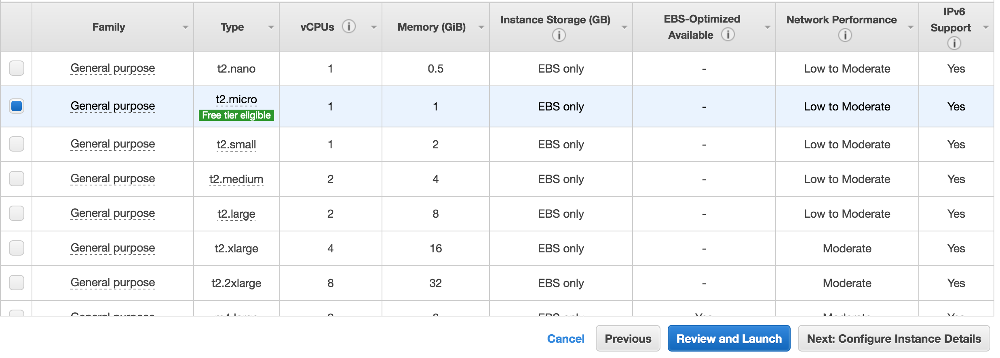
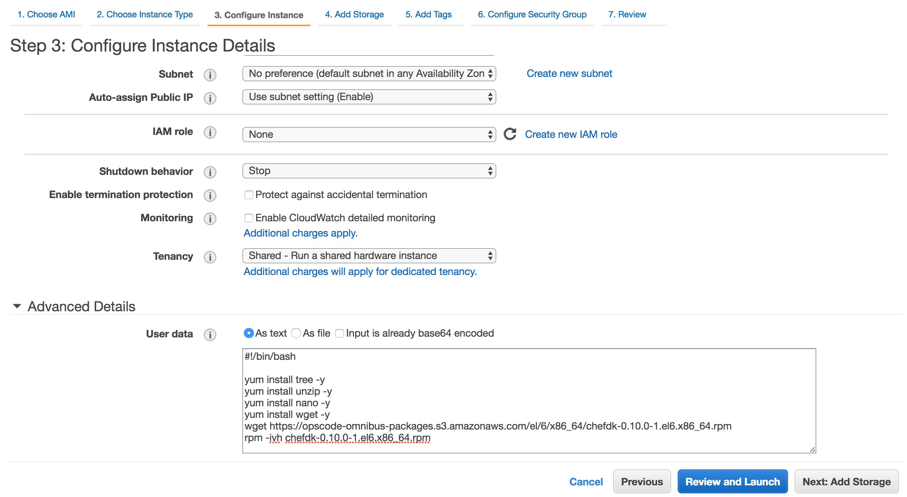
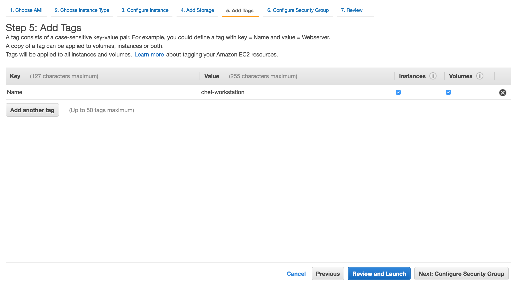
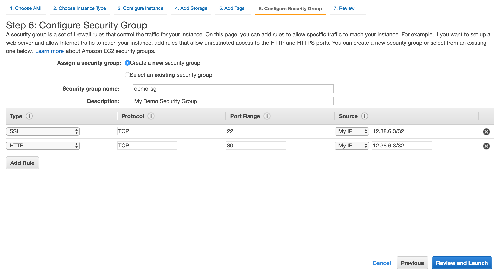
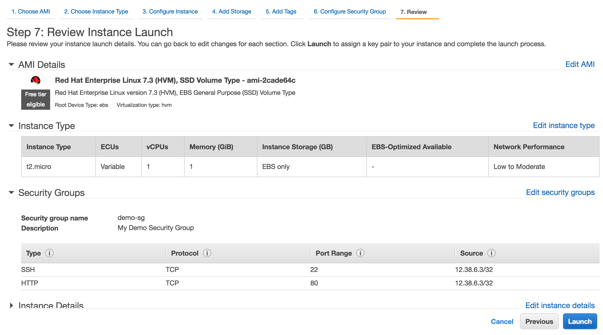
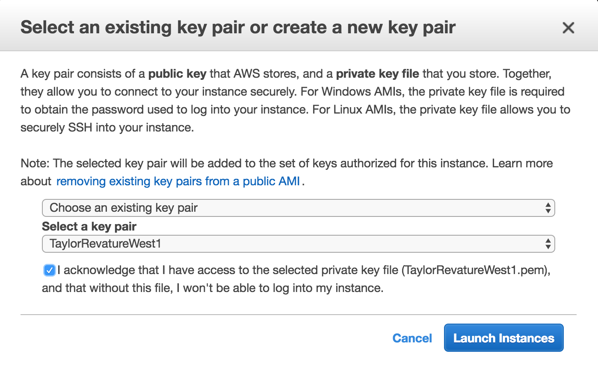

# Intro to Chef

### Sections
* [Launch an EC2 instance](#launch-an-ec2-instance)
* [Create a Basic Resource](#create-a-basic-resource)
* [Configure a Basic Package and Service](#configure-a-basic-package-and-service)
* [Create a Basic Cookbook](#create-a-basic-cookbook)


### Launch an EC2 instance
This instance will act as our Chef Workstation.  We usually send requests to the chef server so our nodes can be updated.  We'll run the chef commands locally on our linux workstation for now.

###### 1.	Create a Red Hat Linux EC2 Instance.



###### 2. Choose **t2.micro**



###### 3.	Add **User Data**

```sh
#!/bin/bash

yum install tree -y
yum install unzip -y
yum install nano -y
yum install wget -y
wget https://opscode-omnibus-packages.s3.amazonaws.com/el/6/x86_64/chefdk-0.10.0-1.el6.x86_64.rpm
rpm -ivh chefdk-0.10.0-1.el6.x86_64.rpm
```



###### 4. Leave Storage as is

###### 5. Add tag
* **Name** : chef-workstation



###### 6. Configure Security Group
* Create new security group called **demo-sg**
* Allow inbound connections on ports **22** and **80** from **My IP**



###### 7. Review
* Click **Launch**



###### 8. Choose Key Pair
* Ensure you have this key pair.  If not, generate and download a new key pair.
* Click **Launch**



###### 9. SSH into your instance
* First, find the IPv4 Public IP address of your instance
* keypair `-i keypair.pem`
* user `ec2-user`
* ip address `10.10.10.10`

```sh
ssh -i keypair.pem ec2-user@10.10.10.10
```


### Create a Basic Resource
To get started, let's look at a basic configuration management project. You'll learn how to manage the Message of the Day (MOTD) file for your organization. The MOTD file is an example of a resource.

###### 1.	SSH into your Chef Workstation.

When logged in, create a directory called `~/chef-repo`

```sh
mkdir ~/chef-repo
```

###### 2.	Create `hello.rb` recipe
From your `~/chef-repo` directory, create a file named `hello.rb`, add these contents, and then save the file.

```sh
vi ~/chef-repo/hello.rb
```

```ruby
file '/tmp/motd' do
  content 'hello world'
end
```

###### 4.	Apply `hello.rb` recipe
From your terminal window, run the following **chef-client** command to apply what you've written.
* **Note:** typically we send this recipe to a **chef server** to update **node** configuration.

```sh
sudo chef-client --local-mode hello.rb
```

Ensure chef created the `/tmp/motd` file

```sh
vi /tmp/motd
```

###### 5.	Run the `chef-client` command again
**Note:** Chef only does work when resources need updating.

###### 6.	Modify `hello.rb`
In `~/chef-repo/hello.rb`, change "hello world" to something else.

###### 7.	Run the `chef-client` command again
**Note:** Chef does work to apply the resource changes.

###### 8.	Create `goodbye.rb` recipe
OK, you're done experimenting with the MOTD, so let's clean up. Create a new file named `goodbye.rb` and save this content to it.

```sh
vi ~/chef-repo/goodbye.rb
```

```ruby
file '/tmp/motd' do
  action :delete
end
```

###### 9.	Apply `goodbye.rb` recipe
```sh
sudo chef-client --local-mode goodbye.rb
```

Ensure `/tmp/motd` no longer exists

```sh
ls /tmp/motd
```

###### 10.	You may also remove the `hello.rb` and `goodbye.rb` files to clean up.

```sh
rm ~/chef-repo/hello.rb
rm ~/chef-repo/goodbye.rb
```


### Configure a Basic Package and Service
Let's extend what you learned about file management to manage the Apache HTTP Server package and its service.

###### 1.	Create `webserver.rb` recipe

```sh
vi ~/chef-repo/webserver.rb
```

```ruby
package 'httpd'

service 'httpd' do
  action [:enable, :start]
end

file '/var/www/html/index.html' do
  content '<html>
  <body>
    <h1>hello world</h1>
  </body>
</html>'
end
```

###### 2. Apply `webserver.rb` recipe

```sh
sudo chef-client --local-mode webserver.rb
```

###### 3.	Ensure apache is serving our html file

```sh
curl localhost
```

###### 4. Cleanup

```sh
rm ~/chef-repo/webserver.rb
```


### Create a Basic Cookbook
You learned how to manage a package and a service by configuring a web server. You also added a basic web page. However, the code for your HTML page was embedded in the Chef recipe. Let's create a cookbook to make our web server recipe easier to manage.

###### 1.	Create `~/chef-repo/cookbooks` directory
This is where our cookbooks will live.

```sh
mkdir ~/chef-repo/cookbooks
cd ~/chef-repo/cookbooks
```

###### 2.	Generate **learn_chef_httpd** cookbook

```sh
chef generate cookbook learn_chef_httpd
```

###### 4.	Generate **index.html** template
A cookbook [template](https://docs.chef.io/resource_template.html) is an Embedded Ruby (ERB) template that is used to dynamically generate static text files.

```sh
chef generate template learn_chef_httpd index.html
```

###### 5.	Edit template
Now copy the contents of the HTML file from your recipe to the new HTML file, `index.html.erb`.

```sh
vi ~/chef-repo/cookbooks/learn_chef_httpd/templates/default/index.html.erb
```

```html
<html>
  <body>
    <h1>hello world</h1>
  </body>
</html>
```

###### 6.	Edit `default.rb` recipe

```sh
vi ~/chef-repo/cookbooks/learn_chef_httpd/recipes/default.rb
```

```ruby
package 'httpd'

service 'httpd' do
  action [:enable, :start]
end

template '/var/www/html/index.html' do
  source 'index.html.erb'
end
```

###### 7.	Run cookbook
Now run the cookbook. To do so, we use the chef-client command and specify what's called the run-list.

```sh
sudo chef-client --local-mode --runlist 'recipe[learn_chef_httpd]'
```

###### 8.	Note
Previously, you ran `chef-client` to run a single recipe from the command line. A **run-list** specifies each of the individual recipes from your cookbook that you want to apply. Here, you applied just one recipe, but the run-list can contain multiple recipes from multiple cookbooks.

###### 9.	Ensure apache is serving our html file

```sh
curl localhost
```

###### 10.	Remove the **learn_chef_httpd** cookbook from the `~/chef-repo/cookbooks` directory.
* You may also want to shut down your instance
