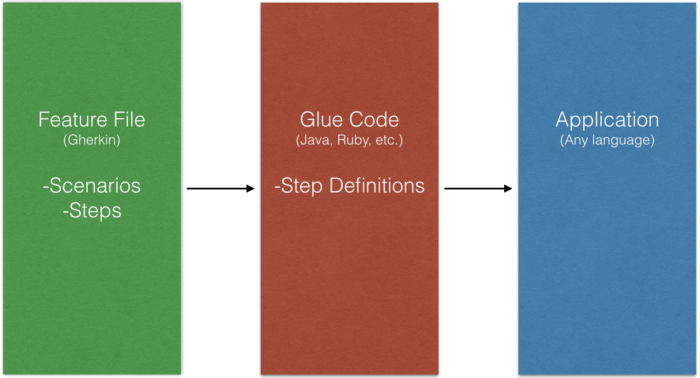

# Cucumber
* Behavior Driven Development (BDD)
* Collaboration tool
* Mix of:
  * Automated Tests
  * Living Documentation
  * Executable Specifications

> Your cucumber features should drive your implementation, not reflect it.
>
> \- Andrew Premdas

## Behavior Driven Development (BDD)

> BDD is a second-generation, outside-in, pull-based, multiple-stakeholder, multiple-scale, high-automation, agile methodology.
>
> It describes a cycle of interactions with well-defined outputs, resulting in the delivery of working, tested software that matters.
>
> \- Dan North

## What BDD is not
* Using "Given/When/Then"
* The responsibility of testers
* An alternative to manual testing

## Living Documentation

> Living documentation is a reliable and authoritative source of information on system functionality, which anyone can easily access.
>
> It is as reliable as the code, but much easier to read and understand.
>
> \- Gojko Adzic

## Activities
* Specification Workshops (Three Amigos)
* Outside-In Development (Programmers)

## Overview



* Glue code and application can be different languages as long as there is some way to talk to the application.
* **Note:** Beneficial to use same language in *glue code* and *application* because you can directly invoke functions.

## Feature File
* Documentation about how a particular piece of software will run
* Plain text file
* Authored collaboratively (testers, developers, business)
* Written in **Gherkin**
* Made up of **Scenarios**

## Scenarios
* Examples of how this feature will behave
* Made up of one or more **Steps**

## Step
* Each **step** maps to a **Step Definition** in the **Glue Code**.
  * Regular Expressions (regex)


## [Gherkin](https://github.com/cucumber/cucumber/wiki/Gherkin)
* Keywords
  * Feature
  * Scenario
  * Given
  * When
  * Then
  * And
  * But

```
Feature: Play with dog

  Scenario: Dog catches frisbee
    Given I have a dog
    And the dog is rested
    When I throw the frisbee
    Then the dog catches the frisbee

  Scenario: Dog naps
    Given I have a dog
    And the dog is not rested
    Then the dog naps
```

* No difference between **Step** keywords: Given, When, Then, And, But
  * They help us understand and it reads better when we use them.

## Useful Links
* [Cucumber Docs](https://cucumber.io/docs)
* [Cucumber Wiki](https://github.com/cucumber/cucumber/wiki/A-Table-Of-Content)
* [Cucumber Java Documentation](https://cucumber.io/docs/reference/jvm#java)
* [Install CLI](https://github.com/cucumber/cucumber/wiki/Install)
* [The world's most misunderstood collaboration tool](https://cucumber.io/blog/2014/03/03/the-worlds-most-misunderstood-collaboration-tool)
* [An Introduction to BDD with Cucumber for Java](https://www.youtube.com/watch?v=MCaXumfckmQ)
* [BDD vs TDD vs ATDD? They're called different things.](https://lizkeogh.com/2011/06/27/atdd-vs-bdd-and-a-potted-history-of-some-related-stuff/)
