# GitHub Pull Request Builder
* [Install Plugin](#install-plugin)
* [Create Access Token](#create-access-token)
* [Configure Jenkins](#configure-jenkins)
* [Create Job](#create-job)
* [Useful Links](#useful-links)

### Install Plugin

**GitHub Pull Request Builder**

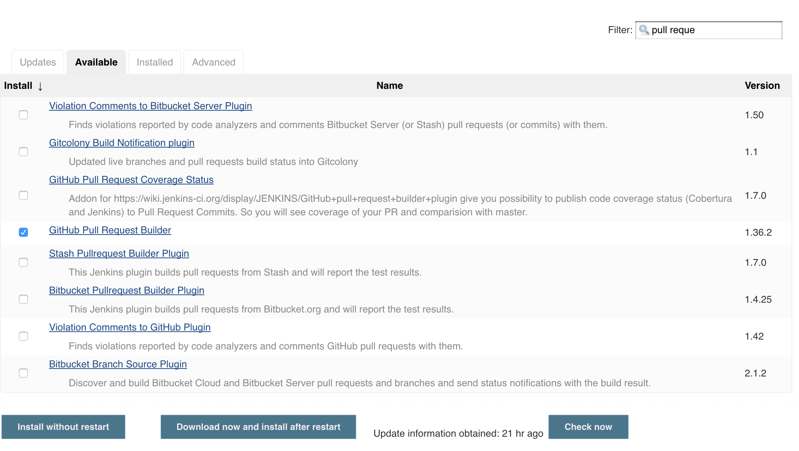

### Create Access Token
Create an access token under a dedicated user *(so your account doesn't blow up with notifications)*.

Login to GitHub *(with user dedicated for automation)* and click *Settings*

Click **Personal Access Tokens**

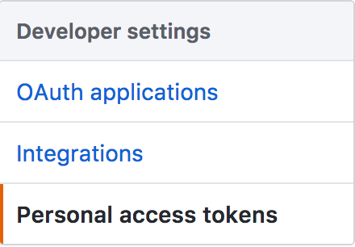

Click **Generate Token**

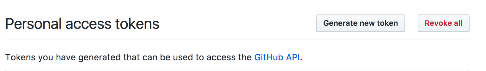

Set token description and scopes

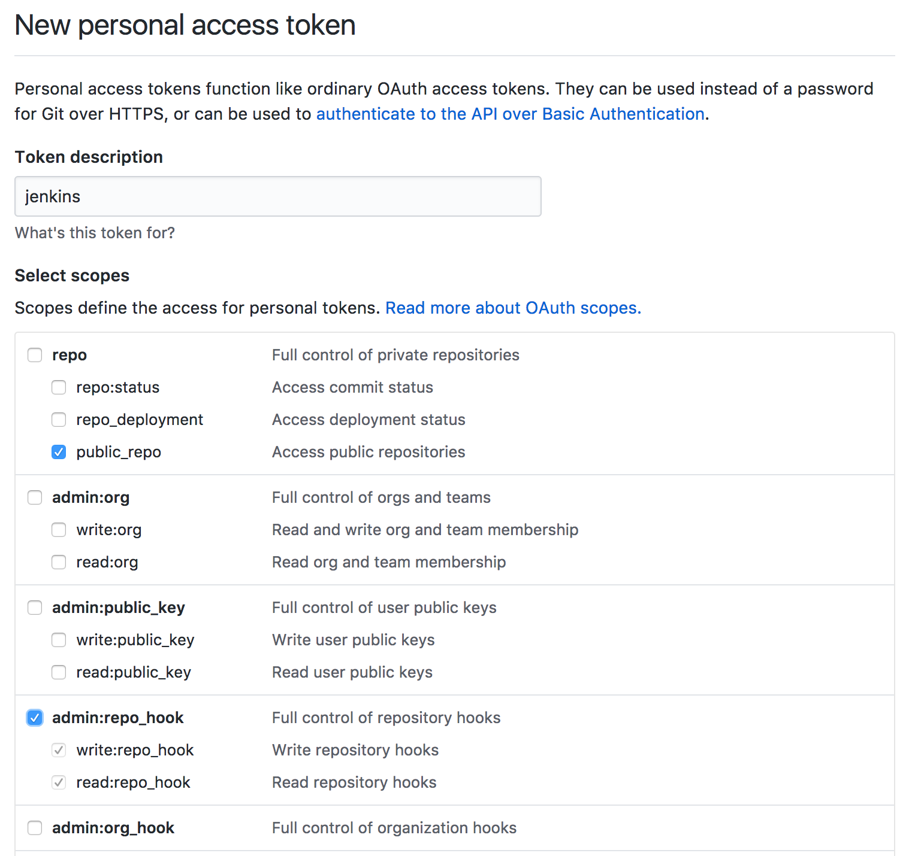

Click **Generate Token**.  Be sure to copy this token.

### Configure Jenkins

Click on **Manage Jenkins** then **Configure System**

Scroll down to **GitHub Pull Request Builder**

Add a new *Credential*

Paste your token in the *Secret* section.

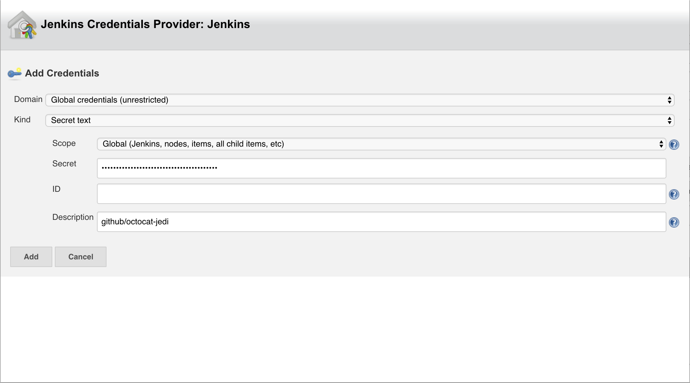

Test that your access token has the correct scopes

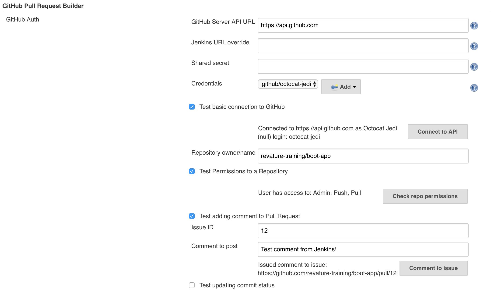

Click **Save**

### Create Job

Click **New Item**

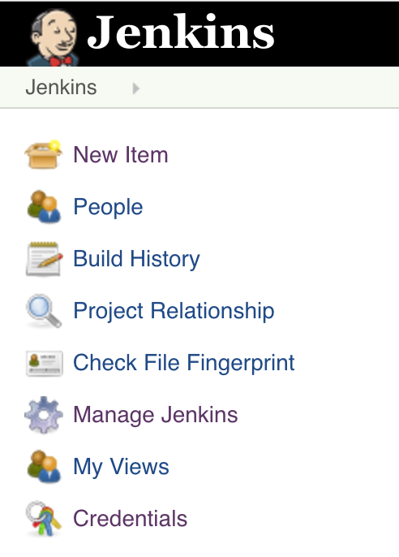

Select *Maven project*

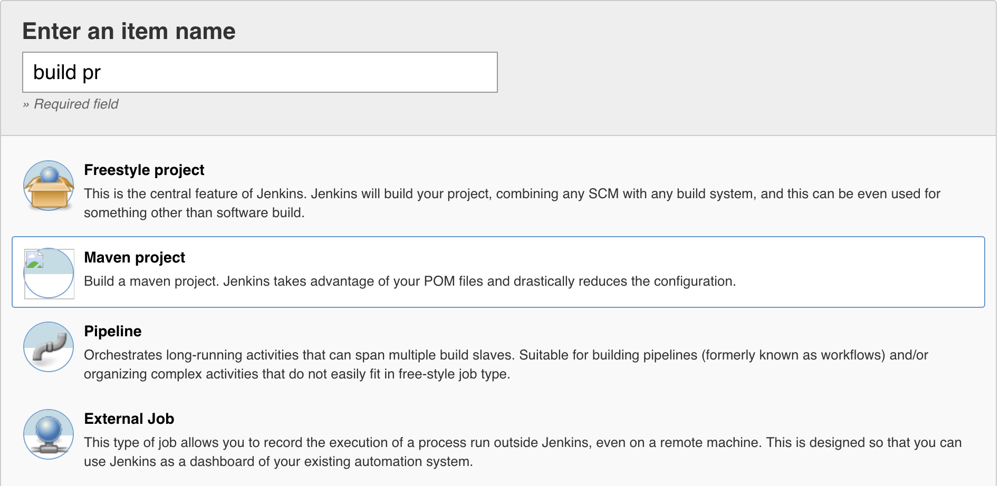

Fill out **GitHub project**

url: `https://github.com/revature-training/boot-app/`

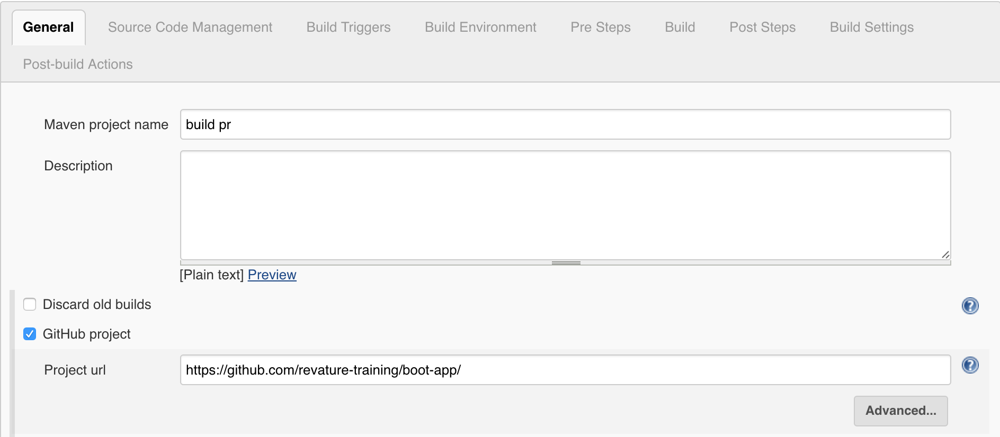

Fill out **Source Code Management**

* url: `https://github.com/revature-training/boot-app.git`
* name: `origin`
* refspec: `+refs/pull/*:refs/remotes/origin/pr/*`
* Branch Specifier: `${sha1}`

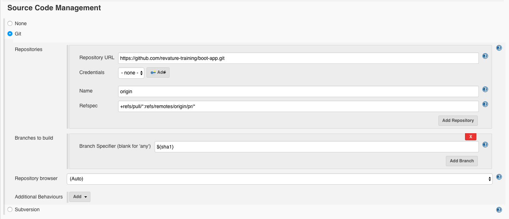

Fill out **Build Triggers**
* Select *GitHub Pull Request Builder*

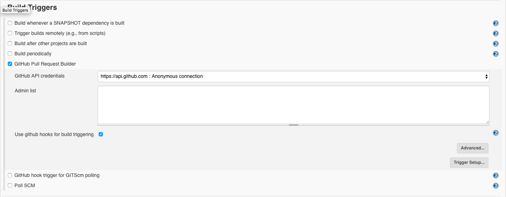

In the **Advanced** section of *Build Trigger*, select the following:

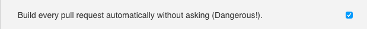

Fill out **Build**

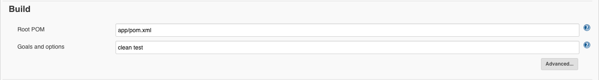

Click **Save**

Create a branch, push, create a PR.

You now have your very own CI pipeline!

###### Note

A GitHub webhook will be created for you on the repo.
* Click on repo *Settings*
* Click *Webhooks*

You may want to add the following events:

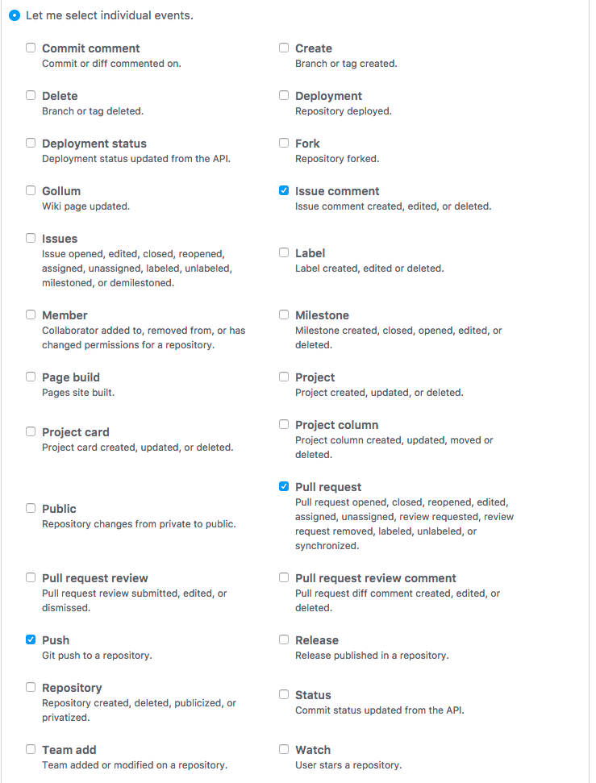

###### Note

If you have a protected branch *(like `master`)*, you can require status checks to pass before allowing PRs to merge.

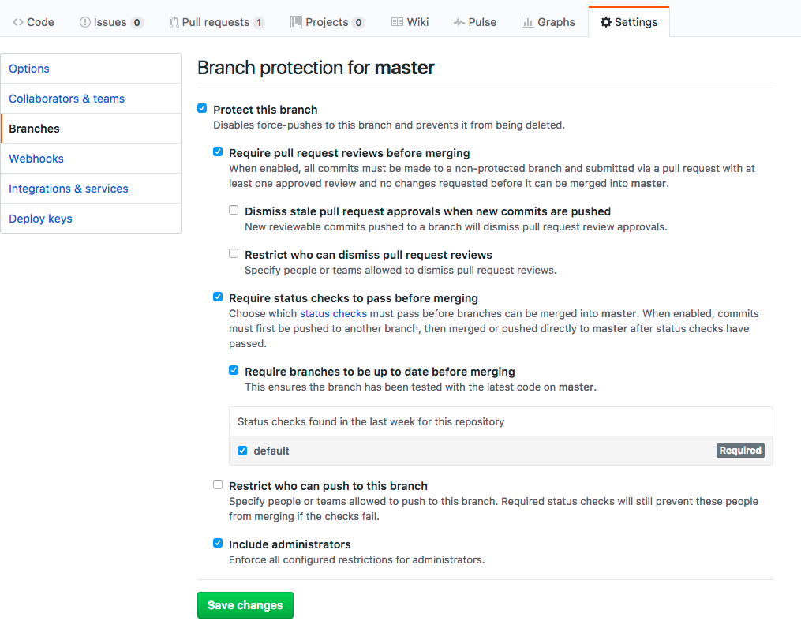

### Useful Links
* [plugin docs](https://wiki.jenkins-ci.org/display/JENKINS/GitHub+pull+request+builder+plugin)
* [Blog - Building GitHub Pull Requests with Jenkins](https://www.theguild.nl/building-github-pull-requests-with-jenkins/)
