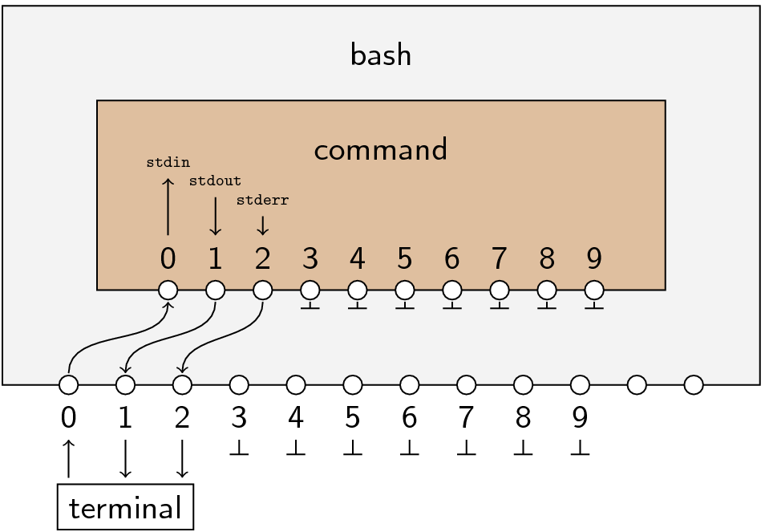

# piping and redirection

### commands *(sort of)*
| command      |      meaning      |
|:------------:|:-----------------:|
|      >       |       STDOUT      |
|      >>      | STDOUT *(append)* |
|      <       |       STDIN       |
|      2>      |       STDERR      |
|    &#124;    |        Pipe       |

# I/O Redirection
* **streams** - there are always 3 streams: STDIN, STDOUT, STDERR
  * **STDIN** - Standard Input
  * **STDOUT** - Standard Output
  * **STDERR** - Standard Error




### Redirection of STDOUT - Replace vs Append

Redirect **STDOUT** of `ls` to `myfile.txt`.
* Notice this replaces the contents of `myfile.txt` each time

```sh
ls > myfile.txt
```

Append to `myfile.txt`
```sh
ls >> myfile.txt
```

### Redirection - STDERR
`zzz` is not a command.  Redirect STDERR to `errors.txt`
```sh
zzz 2> errors.txt
```

### Redirection - STDIN

Create `evil-echo.sh` script.
```sh
#!/bin/bash

read input

echo "You are $input"
```

Make the `evil-echo.sh` script executable
```sh
ls -l evil-echo.sh

chmod 744 evil-echo.sh

ls -l evil-echo.sh
```

Run it.
```sh
./evil-echo.sh
```

Create `some-input.txt` file.
```sh
echo "an awesome person" > some-input.txt
```

Redirect STDIN
```sh
./evil-echo.sh < some-input.txt
```

[evil echo example](../scripts/evil-echo/)

# Piping
* Output of one program becomes input for another
* Use the pipe character: `|`

```sh
ls
```

```sh
ls | head -5
```

```sh
ls | head -5 | tail -3
```
