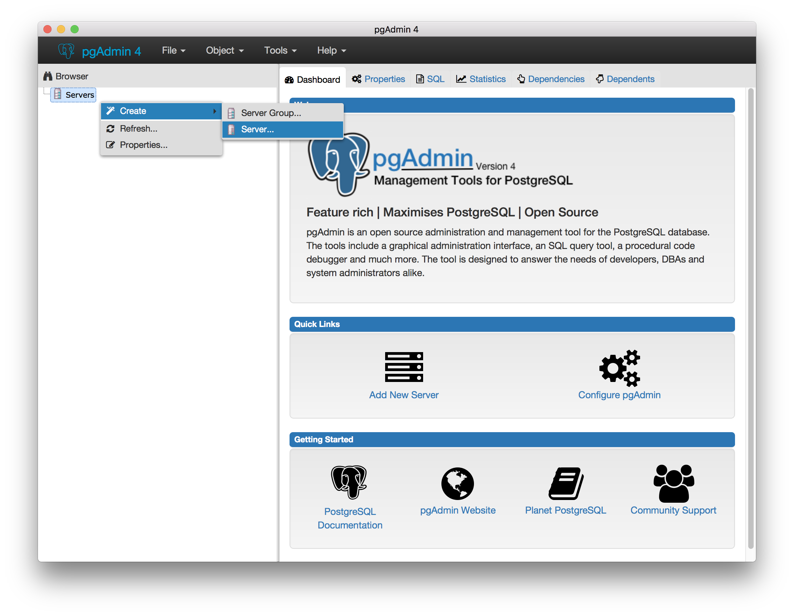
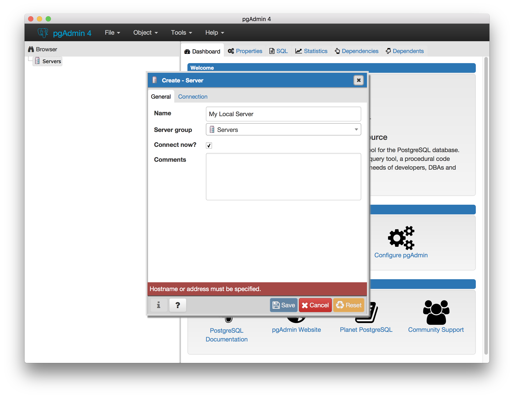
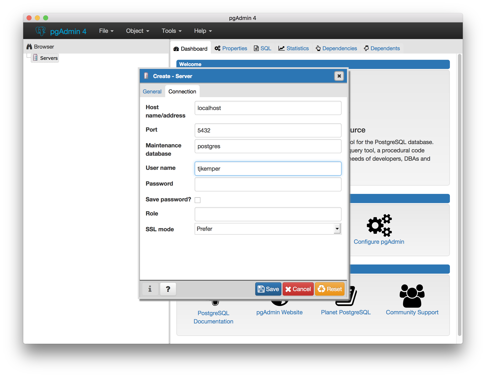
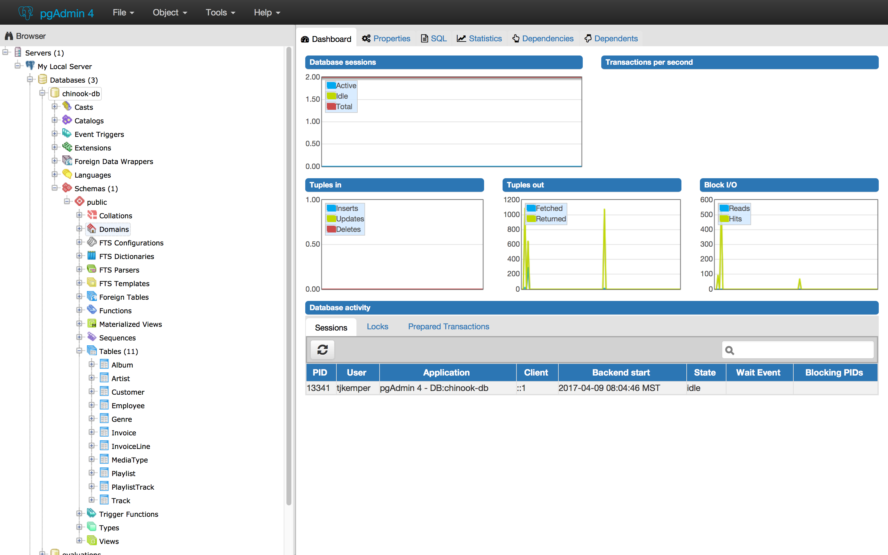

# PostgreSQL

###### 1. Install PostgreSQL

```
brew install postgresql
```

###### 2. Ensure PostgreSQL was installed correctly
```
psql --version
```

**Note:** `brew info` is useful
```
brew info postgresql
```

###### 3. Start PostgreSQL database server
```
brew services start postgresql
```

###### 4. Ensure PostgreSQL is running
```
brew services list
```

<br/>

# pgAdmin

###### 1. Install pgAdmin4
This is a GUI client for PostgreSQL *(a little easier to use than command line)*

```
brew cask install pgadmin4
```

###### 2. Open pgAdmin4
* `Command Space`
* Type in pgAdmin
* `Enter`

###### 3. Create connection to local PostgreSQL database server

Right click *Servers* -> *Create* -> *Server*



Give the server a name



* **Host** should be `localhost`
* **Username** should be the same as your computer's username.  If you are unsure, run following command:

```
whoami
```



# [Chinook](https://chinookdatabase.codeplex.com/)
Chinook is a sample database with 11 tables and a lot of data.  It's commonly used for learning sql.

###### 1. Create `chinook-user` user and `chinook-db` database
```
createuser -s chinook-user
createdb -O chinook-user chinook-db
```

###### 2. Populate the `chinook` database with tables & data
```
psql chinook-db chinook-user -f scripts/Chinook_PostgreSql.sql
```

###### 3. Verify setup is correct *(command line)*

```
psql chinook-db chinook-user
```

```
\dt
```

You should see 11 tables

###### 4. quit out of `psql`

```
\q
```

###### 5. Verify setup is correct *(pgAdmin)*



<br/>

# Useful Links
* [PostgreSQL Command Line Cheat Sheet](http://blog.jasonmeridth.com/posts/postgresql-command-line-cheat-sheet/)
* [Chinook Schema](https://chinookdatabase.codeplex.com/wikipage?title=Chinook_Schema&referringTitle=Documentation)
